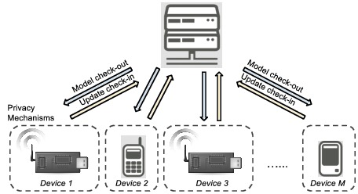

### Crowd-ML (Machine Learning)
#### is a framework for a crowd of devices to perform machine learning with privacy.
IoT, 
Can a crowd of machines learn together privately and without a central storage? 

The idea has been featured in a technology news website [Gigaom] (https://gigaom.com/2015/01/22/researchers-show-a-machine-learning-network-for-connected-devices/). 

### What it does
The library allows devices (Android, iOS, and python clients) to learn a common classifier/regression model with differential privacy, by solving the ERM problem: min_w f(w) = 1/M sum_{i=1}^M f_i(w), where f_i(w) = 1/n sum_j l(h_w(x_{ij}), y_{ij}).
The library implements private distributed synchronous risk minimization based on [Hamm et al., ICDCS'15](docs/icdcs15_jh_final.pdf), using Google Firebase as a simple and robust syncrhonization method.

### Todo
We'll make it public by June 19th  

2. Add header in every file
5. Server app more robust? (wrong data size, nan, etc)
6. Notion of a session: one firebase db - one server app - clients
7. How does firebase verify clients? Later.
8. Client
  * Initially asks for id and passwd. Server URL and .JSON is embedded.
  * If paramIter changes, it reset the process.  
9. Server
  * Has full control over the clients?
  * Command: pause, resume, restart, expire
  * Useful for a new session with different parameters, e.g., with different loss types.  

10. firebase:crowdml/params: paramIter, D, K, L, N, batchSize, lossType=('Hinge','Softmax','LogReg'), noiseType=(Gaussian|Laplace|NoNoise), noiseScale, trainingFeatureFile, trainingLabelFile
11. firebased:crowdml/users/uid/paramIter: 

12. No constant files for clients.

### Features
#### Implemented client types
Android (JAVA), iOS (Objective C), linux (python)

#### Implemented server types
Node.js,  python

#### Examples
* MNIST-binary
* MNIST-10

#### User choices

* Loss function / classifiers: binary logistic regression, softmax, binary SVM with hindge loss 

* lambda: regulization coeff

* Noise:  type {Laplace, Gaussian}, scale s

* Learning rate: constant, 1/t, 1/sqrt{t}, AdaGrad, RMSprop

* M: max number of devices

* T: Total number of iterations

* T_test: training/test error check interval

* b_client: minibatch size on the client

* b_server: minibatch size on the server

### How to use the Crowd-ML library
#### 1. Set up firebase account.
See [firebase/readme.md](firebase/readme.md) for more instructions.
#### 2. Download and build client apps
Currently, the client uses pre-stored local data such as MNIST.
The users of this library should replace it with custom data sensing or collecting routines.
For iOS devices, see [client/iOS/readme.md](client/iOS/readme.md).
For Android devices, see [client/android/readme.md](client/Android/readme.md).
For python clients, see [client/python/readme.md](client/python/readme.md).
#### 3. Download and change server-side app.
See [server/readme.md](server/readme.md) for more instructions.
#### 4. Distribute client apps to users and start the server-side app.

### Acknowledgements

* Jihun Hamm (PI, OSU)
* Jackson Luken (Undergraduate, OSU)
* Yani Xie (Undergraduate, OSU)

This research was supported in part by Google Faculty Research Award 2015 and Google Internet of Things Technology Research Award 2016. 

### License
-------
Released under the Apache License 2.0.  See the [LICENSE.txt](LICENSE.txt) file for further details.

